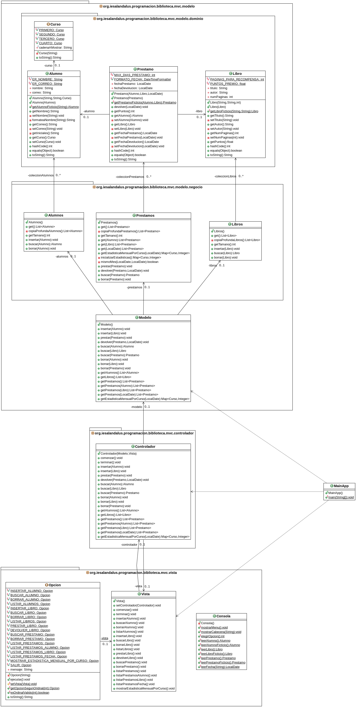

# Tarea: Biblioteca IES Al-Ándalus
## Profesor: José Ramón Jiménez Reyes
## Alumno: Marta Yebra González

Desde el IES Al-Ándalus nos acaban de comentar que por favor eliminemos la restricción de tamaño en los datos de la aplicación. Por lo que decidimos utilizar estructuras dinámicas de datos, en concreto `Listas`. Para las diferentes clases del modelo que contienen las colecciones de objetos del dominio (las que están incluidas en el paquete `negocio`) deberemos sustituir los `Array` por `ArrayList` y, cómo no, ajustar los diferentes métodos para que sigan haciendo lo mismo que antes, pero utilizando las nuevas estructuras de datos. Como observarás, los métodos privados que teníamos antes desaparecen ya que ahora no serán necesarios.

También nos han comentado que si podemos hacer que los listados que muestra la aplicación se muestren siguiendo un determinado orden. En concreto nos piden:

- Los alumnos se ordenarán por su nombre.

- Los libros se ordenarán por su título y en caso de títulos iguales (ya que existen libros distintos con el mismo título y diferente autor) se ordenarán por el autor.

- Los préstamos se ordenarán por fecha de préstamo, para fechas iguales los ordenaremos por alumno (por su nombre) y en caso que los alumnos también coincidan los ordenaremos por libro (por título y autor). Si estamos listando los préstamos para un alumno dado, sólo ordenaremos por fecha de préstamo y, en caso de que coincidan, por libro. Si listamos los préstamos de un libro dado, simplemente ordenaremos por fecha de préstamo y, en caso de coincidencia, por alumno.

También nos han pedido que tengamos en cuenta algunas restricciones de integridad, aparte de las que ya habíamos tenido en cuenta: al insertar un préstamo comprobábamos que el alumno existe y utilizamos el alumno encontrado para el préstamo. Lo mismo hacíamos con los libros ya que comprobábamos que el libro existe y utilizamos para el préstamo dicho libro. Pues ahora queremos contemplar también estas restricciones:

- Al borrar un alumno debemos borrar todos los préstamos asociados al mismo.

- Al borrar un libro debemos borrar todos los préstamos asociados al libro.

Por último, también nos han pedido que ofrezcamos la posibilidad de mostrar una estadística mensual para un mes dado, en la que se nos informe de los puntos obtenidos ese mes para cada uno de los cursos.

Por tanto, esas serán las tareas que abarcaremos para este **segundo spring** de nuestra tarea.

El diagrama de clases queda como te muestro a continuación y poco a poco te iré explicando los diferentes pasos a realizar:

En este repositorio de GitHub hay un esqueleto de proyecto gradle que ya lleva incluidos todos los test necesarios que el programa debe pasar.

Por tanto, tu tarea va a consistir en completar los siguientes apartados:

1. Lo primero que debes hacer es realizar un `fork` del repositorio donde he colocado el proyecto gradle con la estructura del proyecto y todos los test necesarios. Clona tu repositorio remoto recién copiado en github a un repositorio local que será donde irás realizando lo que a continuación se te pide. Añade tu nombre al fichero `README.md` en el apartado "Alumno". Copia los ficheros del directorio `src/main/java` de tu tarea anterior al repositorio local. Realiza tu primer commit.
2. Refactoriza la clase `Alumnos` (y todas las necesarias para que todo siga funcionando igual) para que utilice `ArrayList` en vez de `Arrays`. Realiza un commit.
3. Refactoriza la clase `Libros` (y todas las necesarias para que todo siga funcionando igual) para que utilice `ArrayList` en vez de `Arrays`. Realiza un commit.
4. Refactoriza la clase `Prestamos` (y todas las necesarias para que todo siga funcionando igual) para que utilice `ArrayList` en vez de `Arrays`. Realiza un commit.
5. Haz que el método `get` de la clase `Alumnos`  se adecúe a la ordenación pedida en los requisitos. Realiza un commit.
6. Haz que el método `get` de la clase `Libros` se adecúe a la ordenación pedida en los requisitos. Realiza un commit.
7. Haz que los métodos `get` de la clase `Prestamos` se adecúe a la ordenación pedida en los requisitos. Realiza un commit.
8. Añade a la clase `Prestamos` el método `getEstadistiscaMensualPorCurso`, que devolverá un mapa con los puntos obtenidos por cada curso en un mes dado. Añádelo en todas las clases necesarias para que se muestre como una opción más del menú y se pueda ejecutar. Realiza un commit.
9. Haz que en la clase `Modelo` se cumplan todas las restricciones de integridad pedida en los requisitos. Revisa que tu código pasa todas las pruebas. Realiza el último commit y sube los cambios a tu repositorio remoto en GitHub.

###### Se valorará:
- La indentación debe ser correcta en todas las clases.
- El nombre de las variables debe ser adecuado.
- Se debe utilizar la clase `Entrada` para realizar la entrada por teclado.
- El proyecto debe pasar todas las pruebas que van en el esqueleto del mismo y toda entrada del programa será validada para evitar que el programa termine abruptamente debido a una excepción.
- Se deben utilizar los comentarios adecuados.
- Se valorará la corrección ortográfica tanto en los comentarios como en los mensajes que se muestren al usuario.

